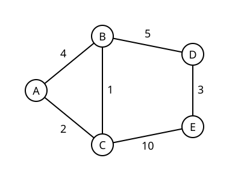

<!-- _class: title -->

# Ab nach Hause

Wie Google Maps & Co. den optimalen Weg finden

Lektion 0 · Beispielfolien

---

<!-- _class: chapter -->

# Graphen

Kapitel 1

---

# Normale Folie

- Ein Graph besteht aus **Knoten** und **Kanten**.
- Kanten können ein Gewicht haben, z. B. eine Länge in Metern.
- Ein Pfad ist eine Folge von Knoten, die durch Kanten verbunden sind.

Weiterführend: [3]

---

# Text links, Bild rechts



Kürzester Pfad von A nach E:

- A → C → B → D → E
- Länge: $2 + 1 + 5 + 3 = 11$

Über C → E direkt wäre es länger: $2 + 10 = 12$

---

# Formeln

Länge eines Pfades $P = (v_0, v_1, \dots, v_k)$:

$$
\ell(P) = \sum_{i=1}^{k} w(v_{i-1}, v_i)
$$

Dijkstra verlangt $w(u, v) \geq 0$ für alle Kanten.

---

# Code

```python
def path_length(path, weight):
    # Sum the weights of consecutive edges
    return sum(weight[u][v] for u, v in zip(path, path[1:]))
```

| Knoten | Abstand von A |
|---|---|
| A | 0 |
| C | 2 |
| B | 3 |
